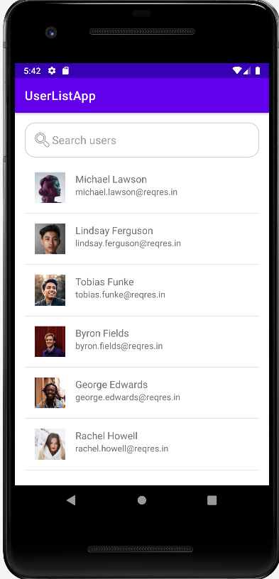
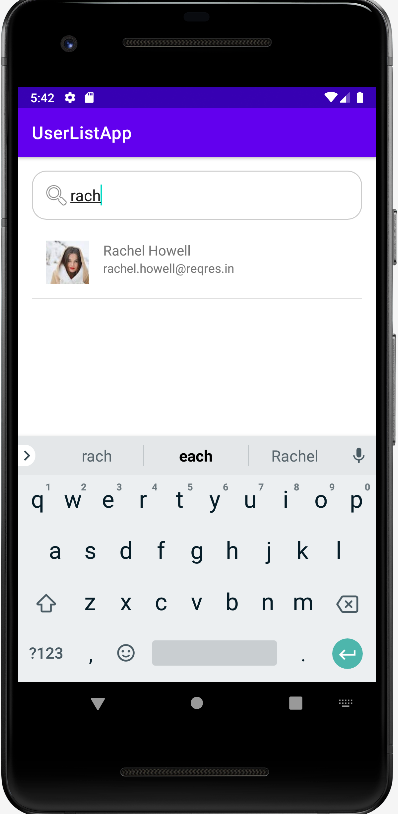
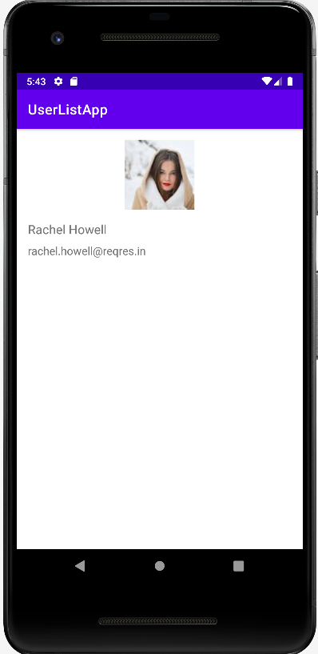

# 👥 User List App

An Android application built with Java that fetches a list of users from a remote API (https://reqres.in), displays them in a custom list view, supports search functionality, pull-to-refresh, and shows detailed information on item click.

## ✨ Features

- 🔍 Search users by name
- 📱 Custom list layout with avatar, name, email, and ID
- 🔁 Swipe-to-refresh functionality
- 📄 Detailed user view on item click
- 📡 API data fetching using OkHttp and Gson
- 📸 Image loading using Glide

## 📸 Screenshots

| User List | Search User | User Detail |
|----------|-------------|-------------|
|  |  |  |

## 🔧 Tech Stack

- Language: Java
- Android SDK: 32
- UI: XML, ListView
- Networking: OkHttp
- JSON Parsing: Gson
- Image Loading: Glide
- Architecture: Activity-based

## 🚀 Getting Started

### Prerequisites

- Android Studio (Arctic Fox or newer)
- Java 8+
- Internet connection for API calls

### Installation

1. Clone the repository:
   ```bash
   git clone https://github.com/your-username/User-List-App.git
